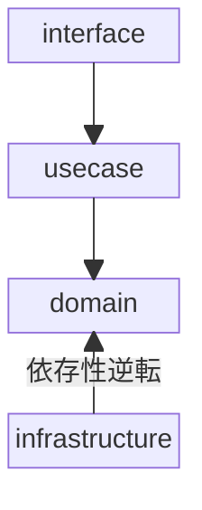

# アーキテクチャ

## 概要

[The Clean Architecture](https://blog.cleancoder.com/uncle-bob/2012/08/13/the-clean-architecture.html)をベースに設計



- `interface` : ユーザーのリクエストをパースし、usecase を呼び出した結果を json や html などの適切な形に整形してユーザーに返す。
- `usecase` : domain を使用し、アプリケーション固有の処理フローを実装する。
- `domain` : ビジネスルールをカプセル化。DB や外部 API リクエストが必要な処理は interface のみ定義する。外部依存なし。
- `infrastructure` : DB ドライバーや外部 API の SDK などを使用し、domain で定義した interface の実装を行う。

## domain

```
├── domain/
│  └── task/
│      ├── entity.go     # task構造体とメソッドを定義
│      ├── errors.go     # エラーを定義
│      ├── factory.go    # taskインスタンスを作成するための構造体
│      └── repository.go # データのアクセスメソッドのinterfaceを定義
```

### entity.go

データモデルを表す構造体と紐づくメソッドを定義する。

[Effective Go](https://go.dev/doc/effective_go#Getters)に従い、外部からアクセスされるフィールドは public で定義し、Getter は定義しない。

```go
type Status string

const (
	StatusTodo Status = "TODO"
	StatusDone Status = "DONE"
)

type Task struct {
	ID        string
	Title     string
	Status    Status
	CreatedAt time.Time
	UpdatedAt time.Time
}

func (t *Task) UpdateStatus(status Status) error {
	ps, err := ParseStatus(string(status))
	if err != nil {
		return fmt.Errorf("task.UpdateStatus: %w", err)
	}
	t.Status = ps
	return nil
}

func ParseStatus(status string) (Status, error) {
	switch s := Status(status); s {
	case StatusTodo, StatusDone:
		return s, nil
	default:
		return "", fmt.Errorf("task.ParseStatus: %w", ErrInvalidStatus)
	}
}
```

### errors.go

対象 domain の操作で発生するエラーを定義

```go
var (
	ErrInvalidID     = errors.New("task: invalid id")
	ErrInvalidStatus = errors.New("task: invalid status")
	ErrInvalidTitle  = errors.New("task: invalid title")
	ErrNotFound      = errors.New("task: not found")
)
```

### factory.go

entity 構造体のコンストラクタを提供する Factory Method を定義する。

```go
type Factory struct {
	idGenerator id.Generator
}

func NewFactory(
	idGenerator id.Generator,
) *Factory {
	return &Factory{
		idGenerator: idGenerator,
	}
}

func (f *Factory) New(title string) *Task {
	id := f.idGenerator.NewID()
	return &Task{
		ID:        id,
		Title:     title,
		Status:    StatusTodo,
		CreatedAt: time.Now(),
		UpdatedAt: time.Now(),
	}
}
```

### repository.go

データのアクセスメソッドの interface を定義

tx に nil を渡すとトランザクション無しで実行する。

```go
type Repository interface {
	Get(ctx context.Context, tx tx.Tx, id string) (*Task, error)
	List(ctx context.Context, tx tx.Tx) ([]*Task, error)

	Create(ctx context.Context, tx tx.Tx, task *Task) error
	Update(ctx context.Context, tx tx.Tx, task *Task) error
	Delete(ctx context.Context, tx tx.Tx, id string) error
}
```

## usecase

```
└── usecase/
    └── task.go
```

エンティティ を使用してアプリケーション固有の処理フローを記述する。

usecase のメソッドを読めば全体の処理の流れを把握できるようにする。

```go
func (u *TaskUseCase) Get(ctx context.Context, id string) (*task.Task, error) {
	pi, err := task.ParseID(id)
	if err != nil {
		return nil, fmt.Errorf("usecase.TaskUseCase.Get: %w", err)
	}

	task, err := u.taskRepository.Get(ctx, nil, pi)
	if err != nil {
		return nil, fmt.Errorf("usecase.TaskUseCase.Get: %w", err)
	}

	return task, nil
}
```

## interface

domain, usecase が特定の DB や外部 API、フレームワークに依存しないように interface レイヤーで吸収する。

```
├── interface/
│   └── http/
│       ├── hundler/
│       │   ├── healthz.go
│       │   └── task.go
│       └── response/
│           ├── error.go
│           ├── render.go
│           └── task.go
```

外部から内向きのリクエストを処理する。

リクエストを usecase が受け取る型にデコードして usecase を呼び出し、結果を json や html などの適切なフォーマットに変換してレスポンスを返す。

```go
// GET /core/v1/task/get
func (h *TaskHandler) HandleGetV1(w http.ResponseWriter, r *http.Request) {
	// 1番初めにリクエストとレスポンスの変数を定義してI/Oを読み取りやすくする。
	var query struct {
		ID string `query:"id"`
	}
	var successResponse response.Task
	var errorResponse response.Error

	ctx := r.Context()

	// 型のパースだけinterfaceレイヤーで行う。
	// 詳細なバリデーションはusecase以降で行う。
	if err := querydecoder.Decode(r.URL.Query(), &query); err != nil {
		slog.WarnContext(ctx, "handler.TaskHandler.HandleGetV1", "err", err)
		errorResponse = response.MapError(response.ErrInvalidRequestBody)
		response.RenderJson(ctx, w, http.StatusBadRequest, errorResponse)
		return
	}

	t, err := h.taskUseCase.Get(ctx, query.ID)

	// 200
	if err == nil {
        // jsonに変換してレスポンスを返す
		successResponse = response.MapTask(t)
		response.RenderJson(ctx, w, http.StatusOK, successResponse)
		return
	}

	// 400
	if errors.Is(err, task.ErrInvalidID) {
		slog.WarnContext(ctx, "handler.TaskHandler.HandleGetV1", "err", err)
		errorResponse = response.MapError(response.ErrInvalidRequestBody)
		response.RenderJson(ctx, w, http.StatusBadRequest, errorResponse)
		return
	}

	// 404
	if errors.Is(err, task.ErrNotFound) {
		slog.WarnContext(ctx, "handler.TaskHandler.HandleGetV1", "err", err)
		errorResponse = response.MapError(response.ErrNotFound)
		response.RenderJson(ctx, w, http.StatusNotFound, errorResponse)
		return
	}

	// 500
	slog.ErrorContext(ctx, "handler.TaskHandler.HandleGetV1", "err", err)
	errorResponse = response.MapError(response.ErrInternalServerError)
	response.RenderJson(ctx, w, http.StatusInternalServerError, errorResponse)
}
```

## infrastructure

```
└── infrastructure/
    └── memory/
        ├── task/
        │   └── repository.go
        └── memory_tx.go
```

内部から外向きのリクエストを処理する。

domain 層で定義した interface の実装を行う。DB や外部 API などとのやり取りを実装する。

```go
func NewRepository(
	tasks map[string]*task.Task,
) task.Repository {
	return &repository{
		tasks: tasks,
	}
}

type repository struct {
	tasks map[string]*task.Task
}

func (r *repository) Get(ctx context.Context, _ tx.Tx, id string) (*task.Task, error) {
	t, ok := r.tasks[id]
	if !ok || t == nil {
		return nil, fmt.Errorf("task.repository.Get: %w", task.ErrNotFound)
	}

	return cloneTask(t), nil
}
```
