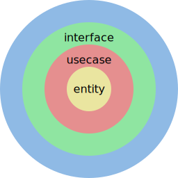

# アーキテクチャ

## 概要

[The Clean Architecture](https://blog.cleancoder.com/uncle-bob/2012/08/13/the-clean-architecture.html)をベースに設計



依存方向を同心円の内向きのみにする。

```
/
├── cmd/
├── entity/
├── interface/
│   ├── inbound/
│   └── outbound/
├── lib/
└── usecase/
```

- `entity` : ビジネスルールをカプセル化。DB や外部 API リクエストが必要な処理は interface のみ定義する。
- `usecase` : entity を使用し、アプリケーション固有の処理フローを実装する。
- `interface/inbound` : ユーザーのリクエストをパースし、usecase を呼び出した結果を json や html などの適切な形に整形してユーザーに返す。
- `interface/outbound` : DB ドライバーや外部 API の SDK などを使用し、entity で定義した interface の実装を行う。
- `lib` : 汎用的なロジックを実装する。
- `cmd` : アプリケーションのエントリーポイントを実装。ここで各レイヤーの依存性注入を行う。

## entity

ビジネスルールをカプセル化する。

DB や外部 API の操作が必要なメソッドは interface のみ定義し、特定の DB や外部 API に依存させない。

usecase を見れば全体の処理の流れを追える状態にするため、極力複数のエンティティに跨るドメインサービスは使用しない。

## usecase

エンティティ を使用してアプリケーション固有の処理フローを記述する。

## interface

### inbound

外部からのリクエストを受け取り、usecase を呼び出し、結果に応じてレスポンスを返す。

### outbound

entity 層で定義した interface の実装を行う。DB や外部 API などとのやり取りを実装する。

## 各レイヤーの依存方向

entity, usecase が API の通信形式や DB などに依存しないようにする。
